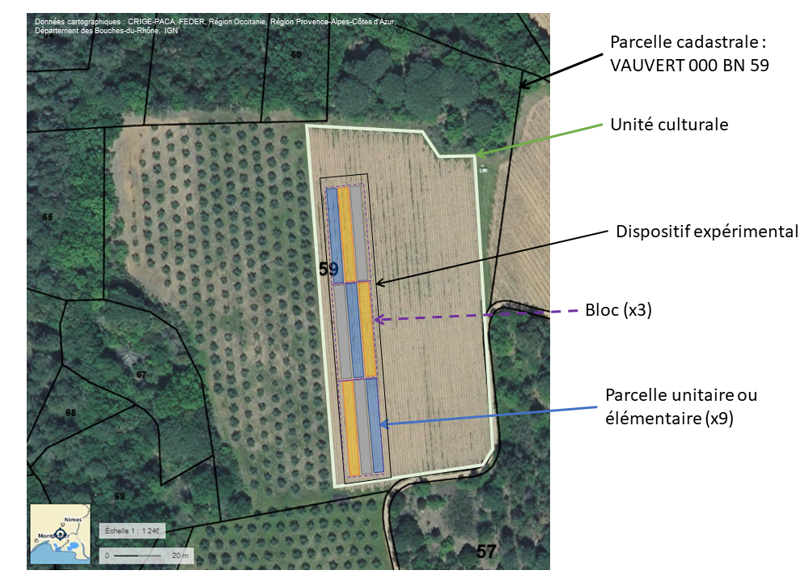

Guide pour la description d’une expérimentation en vigne [PROVISOIRE]
================
Delpuech, Xavier[^1]Dumas, VincentCahurel, Jean-YvesGontier,
LaureClaverie, MarionCharleroy, Arnaud
2/15/23

<link href="guide_contexte_expe_files/libs/lightable-0.0.1/lightable.css" rel="stylesheet" />

Ce guide a pour objectif de définir l’ensemble des éléments permettant
une description suffisamment fine de l’expérimentation pour pouvoir
faciliter la recherche, le croisement et la réutilisation des données
acquises dans un contexte donné. Cet ensemble d’éléments est constitué
de métadonnées[^2], et l’ambition est d’en faire un standard pour le
domaine de l’expérimentation dans la filière viticole. Le champ recouvre
:

- le dispositif expérimental
- la description du contexte : les caractéristiques de la parcelle, du
  sol, de l’itinéraire technique.

A noter qu’il existe des standards de description des ressources plus
génériques, qui seront mobilisés par exemple lors du dépôt d’un jeu de
données dans un entrepôt comme recherche.data.gouv (titre, auteur,
mots-clés…) L’objectif ici est d’adresser à l’échelon inférieur et de
définir des métadonnées pertinentes d’un point de vue technique[^3].
Pour chaque métadonnée, sera précisé :

- sa signification
- le type de contenu : texte, nombre, date
- son format, par exemple pour les dates AAA-MM-DD
- les valeurs possibles le cas échéant (liste de choix)
- un niveau d’obligation

*In fine*, l’utilisation de ce standard permettra de faciliter le
partage et l’interopérabilité des données expérimentales dans la filière
viticole.

Ce guide reprend une description de ce standard dans un format mis en
page. Ce standard sera aussi disponible sous différents formats plus
adaptés à l’interopérabilité informatique (schéma csv, xml, rdf).

Une définition de chaque terme est proposé dans le glossaire.

# Contexte et sources

Ce standard a été proposé dans le cadre du projet VITIS DATA CROP
(CASDAR RT 2020). Ce projet a pour objectif de proposer ensemble
cohérent d’outils et des méthodes pour améliorer l’interopérabilité, le
partage et l’ouverture des données. Un atelier autour du vocabulaire
expérimental s’est tenu le 19 janvier 2023 lors du
[séminaire](https://vignevin.quarto.pub/seminaire-data-2023/) organisé
dans le cadre de ce projet. Cet atelier a permis de collecter un
ensemble de terme dans différents contexte.

Ces éléments ont été complétés par une revue de l’existant, en analysant
les métadonnées proposées dans les systèmes d’informations existants :

- Silex Porte-greffe
- Oscar
- Ocesar
- (VitisExplorer)
- (Sinfonia)

Cette revue a été complétée par des approches similaires conduites lors
de projets de mise en réseau : (Recap&Dep).

L’objectif ici n’est pas d’être exhaustif sur les métadonnées existantes
dans ces différents projets, mais de proposer une sélection de
métadonnées en recherchant un consensus de la communauté scientifique et
technique vigne.

# Le contexte général

## Le projet

Un projet (sous entendu “de recherche”) est le cadre général dans lequel
s’inscrivent des activités de recherche, dont en particulier une ou
plusieurs expérimentations. Connaitre le projet permet d’avoir une
vision d’ensemble des activités conduites et de rechercher des documents
ou compléments d’informations sur le contexte de l’étude. La
connaissance du support financier peut aussi être importante pour
définir le statut des données et leur vocation ou non à être ouverte
(qui peut être précisé dans le plan de gestion de données du projet).
Les métadonnées descriptives du projet sont proposées dans
**?@tbl-metadata_prj**.

<table class="table table-striped table-hover table-condensed" style="margin-left: auto; margin-right: auto;">
 <thead>
  <tr>
   <th style="text-align:left;"> Label </th>
   <th style="text-align:left;"> Description </th>
   <th style="text-align:left;"> Exemple </th>
   <th style="text-align:left;"> Type </th>
  </tr>
 </thead>
<tbody>
  <tr>
   <td style="text-align:left;"> Nom projet </td>
   <td style="text-align:left;"> Nom du projet </td>
   <td style="text-align:left;"> Elaboration d’un outil d’aide à la décision pour la gestion du patrimoine organique des sols viticoles. Paramétrage et validation du modèle AMG </td>
   <td style="text-align:left;"> string </td>
  </tr>
  <tr>
   <td style="text-align:left;"> Acronyme </td>
   <td style="text-align:left;"> Acronyme du projet </td>
   <td style="text-align:left;"> OAD MO </td>
   <td style="text-align:left;"> string </td>
  </tr>
  <tr>
   <td style="text-align:left;"> Date début </td>
   <td style="text-align:left;"> Date de début du projet. Elle est exprimée au format AAAA-MM-JJ suivant la norme internationale ISO 8601. </td>
   <td style="text-align:left;"> 2016-07-01 </td>
   <td style="text-align:left;"> date </td>
  </tr>
  <tr>
   <td style="text-align:left;"> Date fin </td>
   <td style="text-align:left;"> Date de fin du projet. Elle est exprimée au format AAAA-MM-JJ suivant la norme internationale ISO 8601. </td>
   <td style="text-align:left;"> 2017-06-30 </td>
   <td style="text-align:left;"> date </td>
  </tr>
  <tr>
   <td style="text-align:left;"> Objectif </td>
   <td style="text-align:left;"> Description des objectifs poursuivis </td>
   <td style="text-align:left;"> L'objectif de cette action est d'améliorer le conseil en termes de gestion de la matière organique, par une meilleure connaissance du type de produit à apporter en liaison avec les besoins au niveau du sol et les effets attendus, tout en prenant en compte les conditions pédo-climatiques et les condi [...] </td>
   <td style="text-align:left;"> string </td>
  </tr>
  <tr>
   <td style="text-align:left;"> Description </td>
   <td style="text-align:left;"> Description du projet </td>
   <td style="text-align:left;"> Un réseau de 6 parcelles a été mis en place à l'échelle nationale. Sur ce réseau, il s’agit d’acquérir les données concernant le sol, la plante et les produits épandus (variables selon les sites).
Les parcelles d’expérimentation ont été mises en place l’hiver 2008-2009 pour certaines et l’hiver 200 [...] </td>
   <td style="text-align:left;"> string </td>
  </tr>
  <tr>
   <td style="text-align:left;"> Coordinateur nom </td>
   <td style="text-align:left;"> Prénom, Nom de la personne qui coordonne et encadre le projet </td>
   <td style="text-align:left;"> Jean-Yves CAHUREL </td>
   <td style="text-align:left;"> string </td>
  </tr>
  <tr>
   <td style="text-align:left;"> Coordinateur email </td>
   <td style="text-align:left;"> Email de la personne contact </td>
   <td style="text-align:left;"> jean-yves.cahurel@vignevin.com </td>
   <td style="text-align:left;"> email </td>
  </tr>
  <tr>
   <td style="text-align:left;"> Support financier </td>
   <td style="text-align:left;"> Support financier du projet </td>
   <td style="text-align:left;">  FranceAgriMer </td>
   <td style="text-align:left;"> string </td>
  </tr>
</tbody>
</table>

## L’expérimentation

Généralement conduite au sein d’un projet, une expérimentation est une
activité planifiée selon un protocole pour répondre à une question
donnée. Tout comme le projet, elle peut être décrite par quelques
métadonnées décrites dans le **?@tbl-metadata_expe** ci-dessous.

<table class="table table-striped table-hover table-condensed" style="margin-left: auto; margin-right: auto;">
 <thead>
  <tr>
   <th style="text-align:left;"> Label </th>
   <th style="text-align:left;"> Description </th>
   <th style="text-align:left;"> Exemple </th>
   <th style="text-align:left;"> Type </th>
  </tr>
 </thead>
<tbody>
  <tr>
   <td style="text-align:left;"> Nom </td>
   <td style="text-align:left;"> Nom (ou code) usuel de l’expérimentation </td>
   <td style="text-align:left;"> MO-Vauvert </td>
   <td style="text-align:left;"> string </td>
  </tr>
  <tr>
   <td style="text-align:left;"> Date de début </td>
   <td style="text-align:left;"> Date de début de l’expérimentation. Elle est exprimée au format AAAA-MM-JJ suivant la norme internationale ISO 8601. </td>
   <td style="text-align:left;"> 2009-03-01 </td>
   <td style="text-align:left;"> date </td>
  </tr>
  <tr>
   <td style="text-align:left;"> Date de fin </td>
   <td style="text-align:left;"> Date de fin de l’expérimentation. Elle est exprimée au format AAAA-MM-JJ suivant la norme internationale ISO 8601. </td>
   <td style="text-align:left;"> 2020-12-31 </td>
   <td style="text-align:left;"> date </td>
  </tr>
  <tr>
   <td style="text-align:left;"> Objectif </td>
   <td style="text-align:left;"> Description des objectifs poursuivis par l’expérimentation </td>
   <td style="text-align:left;"> L’objectif de cette action est d’améliorer le conseil en terme de gestion de la matière organique, par une meilleure connaissance du type de produit à apporter en liaison avec les besoins au niveau du sol et les effets attendus, tout en prenant en compte les conditions pédo-climatiques et les condit [...] </td>
   <td style="text-align:left;"> string </td>
  </tr>
  <tr>
   <td style="text-align:left;"> Description </td>
   <td style="text-align:left;"> Description de l’expérimentation </td>
   <td style="text-align:left;"> Sur la parcelle gérée par l’IFV en Languedoc-Roussillon, les modalités mises en place sont les suivantes :
- Témoin sans apports (TEM)
- Apport compost déchets verts (DV)
- Apport compost de marc (MARC)
Les modalités ont été mises en place le 17 mars et le 23 mars 2009, avec un dispositif expéri [...] </td>
   <td style="text-align:left;"> string </td>
  </tr>
  <tr>
   <td style="text-align:left;"> Contact nom </td>
   <td style="text-align:left;"> Prénon, Nom de la personne contact </td>
   <td style="text-align:left;"> Xavier, Delpuech </td>
   <td style="text-align:left;"> string </td>
  </tr>
  <tr>
   <td style="text-align:left;"> Contact email </td>
   <td style="text-align:left;"> Email de la personne contact </td>
   <td style="text-align:left;"> xavier.delpuech@vignevin.com </td>
   <td style="text-align:left;"> email </td>
  </tr>
  <tr>
   <td style="text-align:left;"> Projet </td>
   <td style="text-align:left;"> Acronyme du projet ou des projets associés à l'expérimentation </td>
   <td style="text-align:left;"> OAD MO </td>
   <td style="text-align:left;"> string </td>
  </tr>
  <tr>
   <td style="text-align:left;"> Organisation </td>
   <td style="text-align:left;"> Nom de l'institution responsable de l'expérimentation </td>
   <td style="text-align:left;"> IFV Pôle Rhône-Méditerranée </td>
   <td style="text-align:left;"> string </td>
  </tr>
</tbody>
</table>

# Le dispositif expérimental

## Le vocabulaire

Au vignoble , l’expérimentation est généralement mis en place sur une
parcelle ou unité culturale. Le dispositif expérimental est mis en place
sur tout ou partie de la parcelle ([Figure 3.1](#fig-dispositifexpe)),
avec laquelle il partage un certain nombre de caractéristiques en dehors
des traitements appliqués dans le cadre de l’expérimentation.

L’ensemble des unités expérimentales définit le dispositif expérimental.
Chaque unité expérimentale reçoit un traitement, modalité ou combinaison
de modalités des facteurs étudiés. Néanmoins, l’unité d’observation
peut-être restreinte à une sous-partie de l’unité expérimentale
([Figure 3.1 (b)](#fig-disp2)). En vigne, le terme de “placette” est
souvent utilisé pour l’unité d’observation. Enfin, chaque placette est
constituée d’un ensemble de plants de vigne, aussi appelés pieds ou
souches.

Parmi les traitements, le témoin a une définition qui peut être variable
selon les objectifs de l’expérience. On pourra préciser en particulier
s’il s’agit d’un témoin non traité dans le cadre d’un essai d’évaluation
d’efficacité biologique.

<table>
<colgroup>
<col style="width: 50%" />
<col style="width: 50%" />
</colgroup>
<tbody>
<tr class="odd">
<td style="text-align: center;">

<figure>

<figcaption aria-hidden="true">(a) Vue d’ensemble</figcaption>
</figure>

</td>
<td style="text-align: center;">

<figure>

<figcaption aria-hidden="true">(b) Zoom sur une placette</figcaption>
</figure>

</td>
</tr>
</tbody>
</table>

Figure 3.1: Exemple de dispositif expérimental au vignoble

## Les métadonnées du plan d’expérience

Le dispositif en lui-même peut être décrit par quelques métadonnées
(**?@tbl-metadata_design**). Le jeu de données lui-même devra être
complété par un dictionnaire de données, explicitant les variables
mesurés. Ces variables doivent être à chaque fois que c’est possible
reliées à la Vitis Ontology (CO_356).

<table class="table table-striped table-hover table-condensed" style="margin-left: auto; margin-right: auto;">
 <thead>
  <tr>
   <th style="text-align:left;"> Label </th>
   <th style="text-align:left;"> Description </th>
   <th style="text-align:left;"> Exemple </th>
   <th style="text-align:left;"> Type </th>
   <th style="text-align:left;"> Liste </th>
  </tr>
 </thead>
<tbody>
  <tr>
   <td style="text-align:left;"> Description du plan d'expérience </td>
   <td style="text-align:left;"> Brève description du plan d'expérience. Dans certains cas, il n’y a pas de plan d’expérience, et s’il s’agit d’une compilation de différentes études, on peut préciser « données aggrégées ou réduites » </td>
   <td style="text-align:left;"> Dispositif en carré latin à 3 répétitions. 10 ceps sont suivis sur chaque unité expérimentale de 3 inter-rangs de large </td>
   <td style="text-align:left;"> string </td>
   <td style="text-align:left;">  </td>
  </tr>
  <tr>
   <td style="text-align:left;"> Description des facteurs étudiés </td>
   <td style="text-align:left;"> Description des facteurs étudiés et leurs différentes modalités (ou niveaux). </td>
   <td style="text-align:left;"> Apport de matière organique:
- Compost de déchêts verts
- Compost de Marc
- Témoin sans apport </td>
   <td style="text-align:left;"> string </td>
   <td style="text-align:left;">  </td>
  </tr>
  <tr>
   <td style="text-align:left;"> Catégorie de facteur </td>
   <td style="text-align:left;"> Type du facteur étudié </td>
   <td style="text-align:left;"> Intrant </td>
   <td style="text-align:left;"> string </td>
   <td style="text-align:left;"> matériel végétal intrant traitement phytosanitaire entretien du sol  mode de conduite système </td>
  </tr>
  <tr>
   <td style="text-align:left;"> Type de plan d'expérience </td>
   <td style="text-align:left;"> Type de plan d'expérience selon la crop ontology CO_715 </td>
   <td style="text-align:left;"> Carré latin </td>
   <td style="text-align:left;"> list </td>
   <td style="text-align:left;"> Randomisé Carré latin Bloc randomisé Blocs incomplets </td>
  </tr>
  <tr>
   <td style="text-align:left;"> Nombre de répétitions </td>
   <td style="text-align:left;"> Nombre de répétitions par traitement </td>
   <td style="text-align:left;"> 3 </td>
   <td style="text-align:left;"> integer </td>
   <td style="text-align:left;">  </td>
  </tr>
  <tr>
   <td style="text-align:left;"> Taille des unités expérimentales </td>
   <td style="text-align:left;"> Taille en m² des unités expérimentales </td>
   <td style="text-align:left;"> 215 </td>
   <td style="text-align:left;"> integer </td>
   <td style="text-align:left;">  </td>
  </tr>
  <tr>
   <td style="text-align:left;"> Description des unités d'observations </td>
   <td style="text-align:left;"> Brève description des unités d'observations </td>
   <td style="text-align:left;"> placette de 10 ceps située au centre de chaque unité expérimentale </td>
   <td style="text-align:left;"> string </td>
   <td style="text-align:left;">  </td>
  </tr>
  <tr>
   <td style="text-align:left;"> Hétérogénéité </td>
   <td style="text-align:left;"> Descriptif des facteurs d'hétérogénéité éventuels du dispositif expérimental (sol, matériel végétal, topographie…) </td>
   <td style="text-align:left;"> gradient NS de fertilité du sol </td>
   <td style="text-align:left;"> string </td>
   <td style="text-align:left;">  </td>
  </tr>
  <tr>
   <td style="text-align:left;"> Capteurs </td>
   <td style="text-align:left;"> Descriptifs des capteurs équipant la parcelle le cas échéant </td>
   <td style="text-align:left;"> sonde d'humidité des sols de typa capacitive </td>
   <td style="text-align:left;"> string </td>
   <td style="text-align:left;">  </td>
  </tr>
  <tr>
   <td style="text-align:left;"> Performances agronomiques </td>
   <td style="text-align:left;"> Mesures de Performances agronomiques réalisées </td>
   <td style="text-align:left;"> oui </td>
   <td style="text-align:left;"> boolean </td>
   <td style="text-align:left;"> oui non </td>
  </tr>
  <tr>
   <td style="text-align:left;"> Statut hydrique de la vigne </td>
   <td style="text-align:left;"> Mesures de Statut hydrique de la vigne réalisées </td>
   <td style="text-align:left;"> non </td>
   <td style="text-align:left;"> boolean </td>
   <td style="text-align:left;"> oui non </td>
  </tr>
  <tr>
   <td style="text-align:left;"> Statut minéral de la vigne </td>
   <td style="text-align:left;"> Mesures de Statut minéral de la vigne réalisées </td>
   <td style="text-align:left;"> oui </td>
   <td style="text-align:left;"> boolean </td>
   <td style="text-align:left;"> oui non </td>
  </tr>
  <tr>
   <td style="text-align:left;"> Analyses de sols </td>
   <td style="text-align:left;"> Mesures de Analyses de sols réalisées </td>
   <td style="text-align:left;"> oui </td>
   <td style="text-align:left;"> boolean </td>
   <td style="text-align:left;"> oui non </td>
  </tr>
  <tr>
   <td style="text-align:left;"> Suivi maladies </td>
   <td style="text-align:left;"> Mesures de Suivi maladies réalisées </td>
   <td style="text-align:left;"> non </td>
   <td style="text-align:left;"> boolean </td>
   <td style="text-align:left;"> oui non </td>
  </tr>
  <tr>
   <td style="text-align:left;"> Analyse maturité </td>
   <td style="text-align:left;"> Mesures de Analyse maturité réalisées </td>
   <td style="text-align:left;"> oui </td>
   <td style="text-align:left;"> boolean </td>
   <td style="text-align:left;"> oui non </td>
  </tr>
  <tr>
   <td style="text-align:left;"> Vinification </td>
   <td style="text-align:left;"> Mesures de Vinification réalisées </td>
   <td style="text-align:left;"> non </td>
   <td style="text-align:left;"> boolean </td>
   <td style="text-align:left;"> oui non </td>
  </tr>
  <tr>
   <td style="text-align:left;"> Analyses sensorielles </td>
   <td style="text-align:left;"> Mesures de Analyses sensorielles réalisées </td>
   <td style="text-align:left;"> non </td>
   <td style="text-align:left;"> boolean </td>
   <td style="text-align:left;"> oui non </td>
  </tr>
  <tr>
   <td style="text-align:left;"> Suivi couverts végétaux </td>
   <td style="text-align:left;"> Mesures de Suivi couverts végétaux réalisées </td>
   <td style="text-align:left;"> oui </td>
   <td style="text-align:left;"> boolean </td>
   <td style="text-align:left;"> oui non </td>
  </tr>
  <tr>
   <td style="text-align:left;"> Données météo </td>
   <td style="text-align:left;"> Mesures de Données météo réalisées </td>
   <td style="text-align:left;"> oui </td>
   <td style="text-align:left;"> boolean </td>
   <td style="text-align:left;"> oui non </td>
  </tr>
</tbody>
</table>

Dans le cadre d’une expérimentation en vigne, chaque placette (unité
d’observation) peut être définie par quelques champs de métadonnées
proposés dans le **?@tbl-metadata_subplot** ci-dessous.

<table class="table table-striped table-hover table-condensed" style="margin-left: auto; margin-right: auto;">
 <thead>
  <tr>
   <th style="text-align:left;"> Label </th>
   <th style="text-align:left;"> Description </th>
   <th style="text-align:left;"> Exemple </th>
   <th style="text-align:left;"> Type </th>
  </tr>
 </thead>
<tbody>
  <tr>
   <td style="text-align:left;"> Code de la placette </td>
   <td style="text-align:left;"> Code de la placette permetttant son identification unique au sein de l'expérimentation </td>
   <td style="text-align:left;"> M11 </td>
   <td style="text-align:left;"> string </td>
  </tr>
  <tr>
   <td style="text-align:left;"> Nombre de ceps </td>
   <td style="text-align:left;"> Nombre de ceps dans la placette </td>
   <td style="text-align:left;"> 30 </td>
   <td style="text-align:left;"> integer </td>
  </tr>
  <tr>
   <td style="text-align:left;"> Rang </td>
   <td style="text-align:left;"> Numéro du rang de la placette (relatif) </td>
   <td style="text-align:left;"> 5 </td>
   <td style="text-align:left;"> integer </td>
  </tr>
  <tr>
   <td style="text-align:left;"> Position dans le rang </td>
   <td style="text-align:left;"> Position de la placette dans le rang (numéro de la 1er souche de la placette à partir du début du rang) </td>
   <td style="text-align:left;"> 25 </td>
   <td style="text-align:left;"> integer </td>
  </tr>
  <tr>
   <td style="text-align:left;"> Greffon </td>
   <td style="text-align:left;"> Nom de la variété (et clone si connu) produisant les fruits. Format de type "Syrah N Cl300" ou "Grenache B" </td>
   <td style="text-align:left;"> Syrah N Cl300 </td>
   <td style="text-align:left;"> string </td>
  </tr>
  <tr>
   <td style="text-align:left;"> Porte-greffe </td>
   <td style="text-align:left;"> Nom de la variété (et clone si connu) du porte-greffe </td>
   <td style="text-align:left;"> 110R </td>
   <td style="text-align:left;"> string </td>
  </tr>
  <tr>
   <td style="text-align:left;"> Bloc </td>
   <td style="text-align:left;"> Code du bloc surlequel se trouve la placette </td>
   <td style="text-align:left;"> A </td>
   <td style="text-align:left;"> string </td>
  </tr>
  <tr>
   <td style="text-align:left;"> Traitement </td>
   <td style="text-align:left;"> Code du traitement appliqué sur la placette </td>
   <td style="text-align:left;"> TEM </td>
   <td style="text-align:left;"> string </td>
  </tr>
</tbody>
</table>

# Le contexte viticole

## L’exploitation agricole

Les métadonnées d’une exploitation agricole sont proposées dans le
**?@tbl-metadata_estate** ci-dessous.

<table class="table table-striped table-hover table-condensed" style="margin-left: auto; margin-right: auto;">
 <thead>
  <tr>
   <th style="text-align:left;"> Label </th>
   <th style="text-align:left;"> Description </th>
   <th style="text-align:left;"> Exemple </th>
   <th style="text-align:left;"> Type </th>
  </tr>
 </thead>
<tbody>
  <tr>
   <td style="text-align:left;"> Nom de l'exploitation </td>
   <td style="text-align:left;"> Nom de l'exploitation agricole (ou domaine) </td>
   <td style="text-align:left;"> Domaine Cabanis </td>
   <td style="text-align:left;"> string </td>
  </tr>
  <tr>
   <td style="text-align:left;"> Adresse de l'exploitation </td>
   <td style="text-align:left;"> Adresse postale de l'exploitation </td>
   <td style="text-align:left;"> Mas Madagascar, 30600 Vauvert </td>
   <td style="text-align:left;"> string </td>
  </tr>
  <tr>
   <td style="text-align:left;"> Contact exploitation </td>
   <td style="text-align:left;"> Prénon, Nom de la personne contact au sein de l'exploitation </td>
   <td style="text-align:left;"> Jean-Paul, Cabanis </td>
   <td style="text-align:left;"> string </td>
  </tr>
  <tr>
   <td style="text-align:left;"> Surface en vigne (ha) </td>
   <td style="text-align:left;"> Surface exploitée en vigne en ha </td>
   <td style="text-align:left;"> 15 </td>
   <td style="text-align:left;"> decimal </td>
  </tr>
  <tr>
   <td style="text-align:left;"> Numéro CVI </td>
   <td style="text-align:left;"> Numéro d'Exploitation Viti-Vinicole (E.V.V.) communément appelé numéro CVI (pour Casier Viticole Informatisé), à 10 chiffres </td>
   <td style="text-align:left;">  </td>
   <td style="text-align:left;"> string </td>
  </tr>
  <tr>
   <td style="text-align:left;"> Description </td>
   <td style="text-align:left;"> Description ou commentaire sur l'exploitation </td>
   <td style="text-align:left;">  </td>
   <td style="text-align:left;"> string </td>
  </tr>
</tbody>
</table>

## La parcelle expérimentale

Les métadonnées d’une parcelle expérimentale sont proposées dans le
**?@tbl-metadata_plot** ci-dessous.

<table class="table table-striped table-hover table-condensed" style="margin-left: auto; margin-right: auto;">
 <thead>
  <tr>
   <th style="text-align:left;"> Label </th>
   <th style="text-align:left;"> Description </th>
   <th style="text-align:left;"> Exemple </th>
   <th style="text-align:left;"> Type </th>
   <th style="text-align:left;"> Liste </th>
  </tr>
 </thead>
<tbody>
  <tr>
   <td style="text-align:left;"> Latitude </td>
   <td style="text-align:left;"> Latitude du centroïde de la parcelle  (degrés décimaux WGS84) </td>
   <td style="text-align:left;"> 43.6930 </td>
   <td style="text-align:left;"> decimal </td>
   <td style="text-align:left;">  </td>
  </tr>
  <tr>
   <td style="text-align:left;"> Longitude </td>
   <td style="text-align:left;"> Longitude du centroïde de la parcelle (degrés décimaux WGS84) </td>
   <td style="text-align:left;"> 4.2784 </td>
   <td style="text-align:left;"> decimal </td>
   <td style="text-align:left;">  </td>
  </tr>
  <tr>
   <td style="text-align:left;"> Nom de la parcelle </td>
   <td style="text-align:left;"> Nom (ou code) de la parcelle sur laquelle l’expérimentation a lieu </td>
   <td style="text-align:left;"> Syrah prestige </td>
   <td style="text-align:left;"> string </td>
   <td style="text-align:left;">  </td>
  </tr>
  <tr>
   <td style="text-align:left;"> Description de la parcelle </td>
   <td style="text-align:left;"> Brève description ou commentaire sur la parcelle expérimentale </td>
   <td style="text-align:left;"> Parcelle de syrah d'environ, sur un sol fersiallitique typique des Costières de Nîmes. </td>
   <td style="text-align:left;"> string </td>
   <td style="text-align:left;">  </td>
  </tr>
  <tr>
   <td style="text-align:left;"> Commune </td>
   <td style="text-align:left;"> Nom de la commune sur laquelle se trouve la parcelle </td>
   <td style="text-align:left;"> Vauvert </td>
   <td style="text-align:left;"> string </td>
   <td style="text-align:left;">  </td>
  </tr>
  <tr>
   <td style="text-align:left;"> Code INSEE commune </td>
   <td style="text-align:left;"> Code INSEE de la commune (5 caractères alphanumériques) </td>
   <td style="text-align:left;"> 30341 </td>
   <td style="text-align:left;"> string </td>
   <td style="text-align:left;">  </td>
  </tr>
  <tr>
   <td style="text-align:left;"> Bassin viticole </td>
   <td style="text-align:left;"> Bassin viticole dans lequel se trouve la parcelle </td>
   <td style="text-align:left;"> Languedoc-Roussillon </td>
   <td style="text-align:left;"> list </td>
   <td style="text-align:left;"> Alsace et Est Armagnac Bourgogne Beaujolais Jura Savoie Champagne Cognac Languedoc-Roussillon Provence-Corse Sud-Ouest Toulouse-Pyrénées Val de Loire Vallée du Rhône Vins Doux Naturels </td>
  </tr>
  <tr>
   <td style="text-align:left;"> Année de plantation </td>
   <td style="text-align:left;"> Année de plantation de la parcelle au format AAAA </td>
   <td style="text-align:left;"> 1998 </td>
   <td style="text-align:left;"> string </td>
   <td style="text-align:left;">  </td>
  </tr>
  <tr>
   <td style="text-align:left;"> Précédent cultural </td>
   <td style="text-align:left;"> Précédent cultural (en particulier si jeune vigne) </td>
   <td style="text-align:left;"> vigne </td>
   <td style="text-align:left;"> string </td>
   <td style="text-align:left;">  </td>
  </tr>
  <tr>
   <td style="text-align:left;"> Greffon </td>
   <td style="text-align:left;"> Nom de la variété (et clone si connu) produisant les fruits. Format de type "Syrah N Cl300" ou "Grenache B" </td>
   <td style="text-align:left;"> Syrah N Cl300 </td>
   <td style="text-align:left;"> string </td>
   <td style="text-align:left;">  </td>
  </tr>
  <tr>
   <td style="text-align:left;"> Porte-greffe </td>
   <td style="text-align:left;"> Nom de la variété (et clone si connu) du porte-greffe </td>
   <td style="text-align:left;"> 110R </td>
   <td style="text-align:left;"> string </td>
   <td style="text-align:left;">  </td>
  </tr>
  <tr>
   <td style="text-align:left;"> Ecartement entre rangs </td>
   <td style="text-align:left;"> Ecartement entre les rangs de vigne, en m </td>
   <td style="text-align:left;"> 2.5 </td>
   <td style="text-align:left;"> decimal </td>
   <td style="text-align:left;">  </td>
  </tr>
  <tr>
   <td style="text-align:left;"> Ecartement entre ceps </td>
   <td style="text-align:left;"> Ecartement entre les ceps de vigne sur le rang, en m </td>
   <td style="text-align:left;"> 1.1 </td>
   <td style="text-align:left;"> decimal </td>
   <td style="text-align:left;">  </td>
  </tr>
  <tr>
   <td style="text-align:left;"> Mode de taille </td>
   <td style="text-align:left;"> Description du mode de taille en place sur la parcelle </td>
   <td style="text-align:left;"> Cordon de Royat </td>
   <td style="text-align:left;"> list </td>
   <td style="text-align:left;"> Taille en gobelet Cordon de Royat Cordon double Guyot simple Guyot double Guyot Poussard Guyot mixte Chablis Taille rase de précision (mécanique) Taille minimale (non-taille) </td>
  </tr>
  <tr>
   <td style="text-align:left;"> Mode de conduite </td>
   <td style="text-align:left;"> Description du mode de conduite de la végétation </td>
   <td style="text-align:left;"> Espalier </td>
   <td style="text-align:left;"> list </td>
   <td style="text-align:left;"> Espalier palissé Taille minimale Gobelet Echalas Déployé(Scott-Henry Smart-Dyson Lys) Lyre ouverte Pergola Tête de saule </td>
  </tr>
  <tr>
   <td style="text-align:left;"> système d'irrigation </td>
   <td style="text-align:left;"> Type de système d'irrigation équipant la parcelle </td>
   <td style="text-align:left;"> goutte-à-goutte aérien </td>
   <td style="text-align:left;"> list </td>
   <td style="text-align:left;"> aucun goutte-à-goutte aérien goutte-à-goutte enterré aspersion submersion </td>
  </tr>
  <tr>
   <td style="text-align:left;"> Altitude </td>
   <td style="text-align:left;"> Altitude au-dessus ne niveau de la mer du dispositif expérimental, en m </td>
   <td style="text-align:left;"> 93 </td>
   <td style="text-align:left;"> decimal </td>
   <td style="text-align:left;">  </td>
  </tr>
  <tr>
   <td style="text-align:left;"> Pente </td>
   <td style="text-align:left;"> Pente moyenne du sol. </td>
   <td style="text-align:left;"> 03 Presque de niveau 0.5-1% </td>
   <td style="text-align:left;"> list </td>
   <td style="text-align:left;"> 01 Flat 0-0.2% 02 De niveau 0.2-0.5% 03 Presque de niveau 0.5-1% 04 très légère pente 1-2% 05 légère pente 2-5% 06 en pente 5-10% 07 pente nette 10-15% 08 pente prononcée 15-30% 09 forte pente 30-60% 10 pente extrême &gt;60% </td>
  </tr>
  <tr>
   <td style="text-align:left;"> Entretien du sol inter-rang </td>
   <td style="text-align:left;"> Description du mode d'entretien du sol majoritaire dans les inter-rangs </td>
   <td style="text-align:left;"> désherbage mécanique </td>
   <td style="text-align:left;"> list </td>
   <td style="text-align:left;"> désherbé enherbé enherbé1/2 enherbé1/3 </td>
  </tr>
  <tr>
   <td style="text-align:left;"> Entretien du sol sous le rang </td>
   <td style="text-align:left;"> Description du mode d'entretien du sol majoritaire sous le rang </td>
   <td style="text-align:left;"> désherbage mécanique </td>
   <td style="text-align:left;"> list </td>
   <td style="text-align:left;"> désherbé enherbé </td>
  </tr>
  <tr>
   <td style="text-align:left;"> Mode de production </td>
   <td style="text-align:left;"> Mode de production </td>
   <td style="text-align:left;"> Agriculture Biologique </td>
   <td style="text-align:left;"> list </td>
   <td style="text-align:left;"> Raisonnée ou conventionnelle Agriculture Biologique Biodynamie </td>
  </tr>
  <tr>
   <td style="text-align:left;"> Type de produit </td>
   <td style="text-align:left;"> Type de production visée </td>
   <td style="text-align:left;"> AOP </td>
   <td style="text-align:left;"> list </td>
   <td style="text-align:left;"> AOP IGP Vins sans IG Raisin de table Eau de vie </td>
  </tr>
  <tr>
   <td style="text-align:left;"> Objectif de rendement </td>
   <td style="text-align:left;"> Objectif de rendement du viticulteur sur la parcelle en t/ha. </td>
   <td style="text-align:left;"> 3.5 </td>
   <td style="text-align:left;"> decimal </td>
   <td style="text-align:left;">  </td>
  </tr>
  <tr>
   <td style="text-align:left;"> Surface (ha) </td>
   <td style="text-align:left;"> Surface en ha de la parcelle expérimentale </td>
   <td style="text-align:left;"> 0.5 </td>
   <td style="text-align:left;"> decimal </td>
   <td style="text-align:left;">  </td>
  </tr>
  <tr>
   <td style="text-align:left;"> Densité de plantation </td>
   <td style="text-align:left;"> Densité de plantation (à l'origine), en nombre de plants par hectare </td>
   <td style="text-align:left;"> 3500 </td>
   <td style="text-align:left;"> decimal </td>
   <td style="text-align:left;">  </td>
  </tr>
  <tr>
   <td style="text-align:left;"> Référence cadastrale </td>
   <td style="text-align:left;"> Référence cadastrale de la parcelle </td>
   <td style="text-align:left;"> VAUVERT000BN59 </td>
   <td style="text-align:left;"> string </td>
   <td style="text-align:left;">  </td>
  </tr>
  <tr>
   <td style="text-align:left;"> Orientation des rangs </td>
   <td style="text-align:left;"> Orientation des rangs </td>
   <td style="text-align:left;"> N-S </td>
   <td style="text-align:left;"> string </td>
   <td style="text-align:left;"> E-O N-S NE-SO NO-SE </td>
  </tr>
</tbody>
</table>

## Le sol

Avoir quelques éléments sur le sol est généralement pertinent pour mieux
appréhender le contexte de production. Les métadonnées liées au sol sont
proposées dans le **?@tbl-metadata_soil** ci-dessous.

<table class="table table-striped table-hover table-condensed" style="margin-left: auto; margin-right: auto;">
 <thead>
  <tr>
   <th style="text-align:left;"> Label </th>
   <th style="text-align:left;"> Description </th>
   <th style="text-align:left;"> Exemple </th>
   <th style="text-align:left;"> Type </th>
   <th style="text-align:left;"> Liste </th>
  </tr>
 </thead>
<tbody>
  <tr>
   <td style="text-align:left;"> Description sol </td>
   <td style="text-align:left;"> Descriptif du type de sol </td>
   <td style="text-align:left;"> sol fersiallitique typique des costières de Nîmes </td>
   <td style="text-align:left;"> string </td>
   <td style="text-align:left;">  </td>
  </tr>
  <tr>
   <td style="text-align:left;"> Profondeur du sol </td>
   <td style="text-align:left;"> Profondeur de sol accessible aux racines de la vigne, en m </td>
   <td style="text-align:left;"> 1.5 </td>
   <td style="text-align:left;"> decimal </td>
   <td style="text-align:left;">  </td>
  </tr>
  <tr>
   <td style="text-align:left;"> Texture dominante du sol </td>
   <td style="text-align:left;"> Texture dominante du sol accessible au racine (texture 6 classes GEPPA) </td>
   <td style="text-align:left;"> L:limoneux </td>
   <td style="text-align:left;"> list </td>
   <td style="text-align:left;"> A:argileux Al:argilo-limoneux As:argile sableuse L:limoneux Sl:sablo-limoneux S:Sableux </td>
  </tr>
  <tr>
   <td style="text-align:left;"> Pierrosité du sol </td>
   <td style="text-align:left;"> Abondance des cailloux en volume (FAO,2006) </td>
   <td style="text-align:left;"> A:abondant 40-80% </td>
   <td style="text-align:left;"> list </td>
   <td style="text-align:left;"> N:aucun cailloux V:très peu (0-2%) F:peu 2-5% C:fréquent 5-15% M:beaucoup 15-40% A:abondant 40-80% D:majoritaire &gt;80% S:concentré sur une couche </td>
  </tr>
  <tr>
   <td style="text-align:left;"> Teneur en MO </td>
   <td style="text-align:left;"> Teneur du sol en matière organique sur l'horizon de surface </td>
   <td style="text-align:left;"> 2 </td>
   <td style="text-align:left;"> decimal </td>
   <td style="text-align:left;">  </td>
  </tr>
  <tr>
   <td style="text-align:left;"> pH sol </td>
   <td style="text-align:left;"> pHeau du sol sur l'horizon de surface </td>
   <td style="text-align:left;"> 6.5 </td>
   <td style="text-align:left;"> decimal </td>
   <td style="text-align:left;">  </td>
  </tr>
  <tr>
   <td style="text-align:left;"> RU du sol </td>
   <td style="text-align:left;"> Réserve utile en eau du sol, en mm </td>
   <td style="text-align:left;"> 120 </td>
   <td style="text-align:left;"> decimal </td>
   <td style="text-align:left;">  </td>
  </tr>
  <tr>
   <td style="text-align:left;"> Type de sol </td>
   <td style="text-align:left;"> Type de sol </td>
   <td style="text-align:left;"> argileux </td>
   <td style="text-align:left;"> list </td>
   <td style="text-align:left;"> argileux argilo-calcaire argilo-sablonneux calcaire calcaro-marneux calcaro-sablonneux marneux marno-sablonneux sablonneux </td>
  </tr>
</tbody>
</table>

## L’itinéraire technique

Tout comme le sol, la connaissance de l’itinéraire technique est utile
pour mieux comprendre les résultats. Les métadonnées liées à
l’itinéraire technique sont proposées dans le **?@tbl-metadata_itk**
ci-dessous, à noter que l’itinéraire technique pouvant varier d’une
année sur l’autre, il est nécessaire de les compléter pour chaque
millésime suivi.

<table class="table table-striped table-hover table-condensed" style="margin-left: auto; margin-right: auto;">
 <thead>
  <tr>
   <th style="text-align:left;"> Label </th>
   <th style="text-align:left;"> Description </th>
   <th style="text-align:left;"> Exemple </th>
   <th style="text-align:left;"> Type </th>
   <th style="text-align:left;"> Liste </th>
  </tr>
 </thead>
<tbody>
  <tr>
   <td style="text-align:left;"> Millésime </td>
   <td style="text-align:left;"> Millésime (saison de production) </td>
   <td style="text-align:left;"> 2010 </td>
   <td style="text-align:left;"> string </td>
   <td style="text-align:left;">  </td>
  </tr>
  <tr>
   <td style="text-align:left;"> Irrigation </td>
   <td style="text-align:left;"> Quantité d'eau apportée par irrigation sur la saison, exprimée en mm/an. 0 si aucune irrigation </td>
   <td style="text-align:left;"> 50 </td>
   <td style="text-align:left;"> decimal </td>
   <td style="text-align:left;">  </td>
  </tr>
  <tr>
   <td style="text-align:left;"> Fertilisation azotée </td>
   <td style="text-align:left;"> Quantité apportée par ha et par an </td>
   <td style="text-align:left;"> 30 </td>
   <td style="text-align:left;"> decimal </td>
   <td style="text-align:left;">  </td>
  </tr>
  <tr>
   <td style="text-align:left;"> Forme azote </td>
   <td style="text-align:left;"> Forme de l'azote apporté : minérale ou organique </td>
   <td style="text-align:left;"> minérale </td>
   <td style="text-align:left;"> list </td>
   <td style="text-align:left;"> minérale organique organo-minérale </td>
  </tr>
  <tr>
   <td style="text-align:left;"> Description fertilisation </td>
   <td style="text-align:left;"> Descriptif de la fertilisation pratiquée sur la parcelle habituellement </td>
   <td style="text-align:left;"> suivant protocole </td>
   <td style="text-align:left;"> string </td>
   <td style="text-align:left;">  </td>
  </tr>
  <tr>
   <td style="text-align:left;"> Mode d'apport </td>
   <td style="text-align:left;"> Mode d'apport des éléments fertilisants </td>
   <td style="text-align:left;"> au sol </td>
   <td style="text-align:left;"> list </td>
   <td style="text-align:left;"> au sol fertirrigation foliaire </td>
  </tr>
  <tr>
   <td style="text-align:left;"> Enherbement temporaire </td>
   <td style="text-align:left;"> Pourcentage d'enherbement temporaire (couverture du sol) le cas échéant (si semis d'engrais vert ou enherbement spontanné) </td>
   <td style="text-align:left;"> 0 </td>
   <td style="text-align:left;"> decimal </td>
   <td style="text-align:left;">  </td>
  </tr>
</tbody>
</table>

# Glossaire

<table class="table table-striped table-hover table-condensed" style="margin-left: auto; margin-right: auto;">
 <thead>
  <tr>
   <th style="text-align:left;"> Terme </th>
   <th style="text-align:left;"> Définition </th>
  </tr>
 </thead>
<tbody>
  <tr>
   <td style="text-align:left;"> dictionnaire de données </td>
   <td style="text-align:left;"> Un dictionnaire de données permet d’expliciter les variables mesurées. Par exemple, pour un fichier tabulé, il peut être nécessaire de spécifier les entêtes des colonnes, les unités utilisées, les acronymes, etc. </td>
  </tr>
  <tr>
   <td style="text-align:left;"> dispositif expérimental </td>
   <td style="text-align:left;"> Ensemble spatial des unités expérimentales, placées dans les conditions de l'expérience, et associé à un protocole. </td>
  </tr>
  <tr>
   <td style="text-align:left;"> expérimentation </td>
   <td style="text-align:left;"> Une expérimentation est une activité planifiée réalisée par un ensemble donné de personnes sur un ensemble donné d'unités d'observation, telles que des plantes, des placettes, des cuves…, impliquant un protocole, des méthodes et un jeu de données résultant </td>
  </tr>
  <tr>
   <td style="text-align:left;"> facteur </td>
   <td style="text-align:left;"> Toute série d'éléments de même nature qui peuvent être comparés au cours d’une expérience, tels qu’une série de variétés, un ensemble de produits phytosanitaires, différerentes doses d’un même engrais, différerentes températures, différentes pressions, etc. </td>
  </tr>
  <tr>
   <td style="text-align:left;"> jeu de données </td>
   <td style="text-align:left;"> Un jeu de données (en anglais dataset ou data set) est un ensemble de valeurs « organisées » ou « contextualisées » (alias « données »), où chaque valeur est associée à une variable (ou attribut) et à une observation. </td>
  </tr>
  <tr>
   <td style="text-align:left;"> modalité </td>
   <td style="text-align:left;"> Chaque facteur étudié peut prendre plusieurs valeurs. Ces différentes valeurs liées à un facteur sont appelées, niveaux ou modalités. Le premier terme étant plutôt employé pour un facteur quantitatif et le deuxième pour un facteur qualitatif. </td>
  </tr>
  <tr>
   <td style="text-align:left;"> parcelle </td>
   <td style="text-align:left;"> Parcelle ayant le même cépage, le même itinéraire technique (conduite et phytosanitaire), la même date de récolte. </td>
  </tr>
  <tr>
   <td style="text-align:left;"> placette </td>
   <td style="text-align:left;"> Unité d'observation sur une parcelle constituée d'un ensemble de plants occupant une surface inférieure ou égale à l'unité expérimentale. </td>
  </tr>
  <tr>
   <td style="text-align:left;"> plan de gestion de données </td>
   <td style="text-align:left;"> Le Data Management Plan ou Plan de gestion de données est un document synthétique qui aide à organiser et anticiper toutes les étapes du cycle de vie de la donnée. Il explique pour chaque jeu de données comment seront gérées les données d’un projet, depuis leur création ou collecte jusqu’à leur partage et leur archivage. </td>
  </tr>
  <tr>
   <td style="text-align:left;"> projet </td>
   <td style="text-align:left;"> Un projet de recherche est le cadre général dans lequel s'inscrivent des activités de recherche, dont en particulier une ou plusieurs expérimentations,en fonctions des objectifs du projet. Il fait généralement l'objet d'un contrat ou d'un accord de subvention avec les organismes de financement apportant un soutien financier. </td>
  </tr>
  <tr>
   <td style="text-align:left;"> protocole </td>
   <td style="text-align:left;"> Document élaboré préalablement à l'installation du dispositif expérimental détaillant le plan d'expérience et les mesures à réaliser. </td>
  </tr>
  <tr>
   <td style="text-align:left;"> témoin non traité (TNT) </td>
   <td style="text-align:left;"> Traitement qui ne reçoit pas aucun des traitements phytosanitaires étudiés dans le cadre d'un essai d'évaluation biologique. L'objectif principal du témoin non traité est de qualifier le niveau d'infestation. </td>
  </tr>
  <tr>
   <td style="text-align:left;"> traitement </td>
   <td style="text-align:left;"> Toute modalité d'un facteur unique ou combinaison de modalités de deux ou plusieurs facteurs étudiés. </td>
  </tr>
  <tr>
   <td style="text-align:left;"> unité d'observation </td>
   <td style="text-align:left;"> Sous-partie de l'unité expérimentale sur laquelle sont réalisées les mesures, généralement au centre de l'unité expérimentale pour éviter les effets de bordure. </td>
  </tr>
</tbody>
</table>

[^1]: xavier.delpuech@vignevin.com

[^2]: Les métadonnées permettent de décrire plus précisément les
    données. Ce sont des données sur les données (Doranum.fr, 2023)

[^3]: Si les métadonnées permettent de standardiser une partie de
    l’information contextuelle des données, elles ne sont pas toujours
    suffisantes et le jeu de données gagnera aussi à être accompagné par
    des documents complémentaires : protocoles, analyses
    complémentaires, photos
